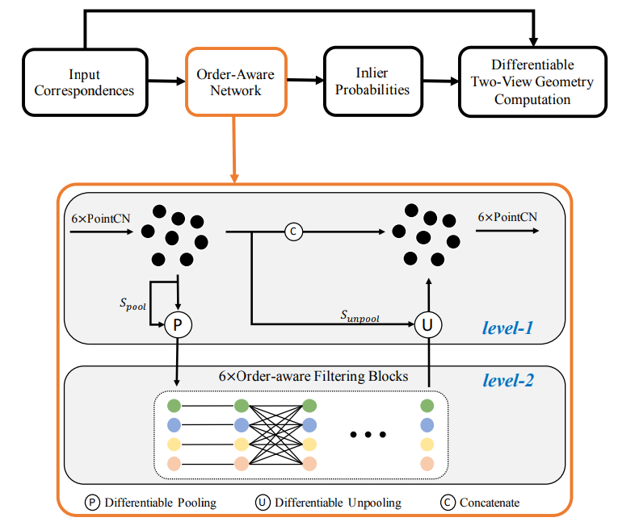
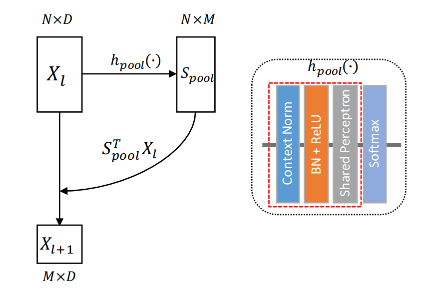
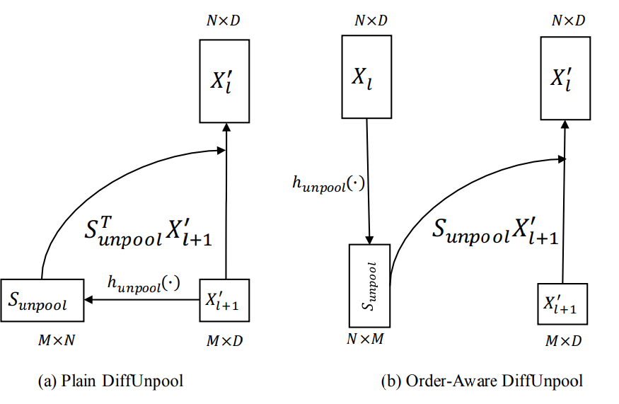
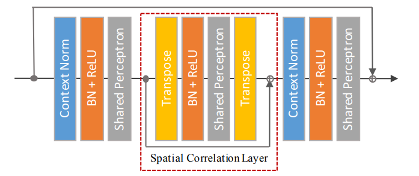

## Learning Two-View Correspondences and Geometry using Order-Aware Network
### 2019 ICCV
### Jiahui Zhang, Dawei Sun, Hongen Liao (HKUST, TsinghuaU, Intel Labs China, Altizure)
[Paper implementation Link](https://github.com/zjhthu/OANet)

##### Why did I read this paper?
Partly implemented in current area of research (3D matching)

#### Paper keywords / Context
Correspondences, Geometry, Camera Intrinsic, Order-aware network, Correspondence Outlier Rejection, Relative Pose estimation

#### What problem does this paper try to solve?
Main Task at hand: Use NN to infer the probability of each correspondence as an inlier, then recover relative pose by regressing the essential matrix for **two-view** geometry estimation. 

Problem to solve: Sparse matches have no well-defined neighbours(unlike point clouds), and there are no relation between correspondences since they are unordered and have no stable relations to be captured. Therefore, this paper aims to introduce well-defined neighbours instead of heuristic neighbours in the form of **learned clusters** which are permutation invariant, and model (to learn) relations between correspondences (clusters) for better performance.

#### Main contributions of the paper
Introduce DiffPool and DiffUnpool layers 
* to capture local context of unordered sparse correspondences in a learnable manner
* "Local context" : well-defined neighbours

Order-Aware Filtering block (with collaborative use of DiffPool operator)
* exploits the complex global context of sparse correspondences

Significantly improves relative pose estimation accuracy on both outdoor and indoor datasets.   

### Key figures of the paper


[Link to PointCN reference](https://arxiv.org/pdf/1711.05971.pdf)
```
DiffPool(left): maps unordered nodes to set of clusters in canonical order
Order-Aware DiffUnPool (right) : upsamples the clusters using spatial information of input nodes
Order-Aware Filtering block (lv 2): correlates clusters to better capture global context
```



incurs a soft assignment using softmax
* soft assignment matrix is learned by hpool

Overall a permutation-invariant operation (proof in paper)
* no matter how the input are permuted, they will be mapped into clusters in a particular **learned canonical order**


incurs a soft assignment using softmax as well

Does not require a fixed size input
* Useful in practice (i.e. can pool nodes to fixed 500 clusters and then upsample clusters back to same size)


complementary to PointCN. Transpose the **spatial and channel** dimensions of features
* Spatial Correlation Layer is orthogonal to PointCN :: therefore complementary.
* these are assembled into one block to better capture the global context.

#### Paper Highlights

* RANSAC is the standard and still the most popular outlier rejection method. (In fact, yields much better results when integrated WITH RANSAC)
* The topic of this work: Solve outlier rejection problem with learning based methods to improve the accuracy of relative pose estimation
* Putative correspondences can be established by finding their nearest neighbours in the other image. Then outlier rejection method is applied to establish geometrically consistent correspondences. Finally, an essential mattrix can be recovered from the inlier correspondences by a [closed-form solution](https://arxiv.org/pdf/1711.05971.pdf).
* Spatial correlation layer applies weight-sharing perceptrons directly on the spatial dimension to establish connections between nodes. Note this operation is different from the FC layer because the weights are shared along the channel dimension, which can help prevent overfitting.
* When applying softmax, the normalizationn directions only has little influence on results.

#### New approach/technique/method used in this paper 
Differentiable Pool / UnPool
* heuristic neighbours -> learned clusters (local neighbours!)
* permutation invariant

Order-Aware Filtering block
* better capture global context through complementary operation with PointCN

#### Noteworthy Experiment - Takeaway
Experiments on YFCC100M and SUN3D dataset 
* better results with RANSAC integration, with a tighter threshold (0.01 --> 0.001)

Ablation study: model size
* Larger model even drops on unknown scenes.
* "Might show that the representational ability of OA filtering block suffices to capure the global context"

SuperPoint gives worse results in outdoor scenes than SIFT when using learned outlier rejection methods, but performs much better than SIFT when only using RANSAC.
* might demonstrate that SuperPoint has better descriptors but less accurate keypoints?
  * Q. How does this co-align with SuperGlue/Point paper?


#### Inputs and Outputs 
Inputs to outlier rejection process: set of putative correspondences
* coordinates of corresponding keypoints in two images, normalized using camera instrinsics

Output of outlier rejection process: probabilities of each correspondence to be an inlier

Inputs to essential matrix regression problem (Relative pose estimation):
* Weights of correspondences, and each correspondence

Outputs to essential matrix regression problem:
* Essential matrix, using [**weighted eight-point algorithm**](https://en.wikipedia.org/wiki/Eight-point_algorithm)


#### Loss function (Objective function)
Summation of classification loss and essential matrix loss, with an alpha coefficient to balance the two losses

Classification loss: Was the probability of being an inlier accurate? 
* Binary Cross Entropy loss for the classification term. The GT is weakly supervised, which is dereived using a geometric error.
* Threshold of 10^-4 is used to determine valid correspondences

Essential matrix loss: Was the regressed essential matrix accurate?
* Either a L2 loss or a **geometry loss**

#### Evaluation Metrics Used
mAP results, with and without RANSAC
* Angular differences between ground truth and predicted vectors for both rotation and translation used as error metric
* Threshold 0.01 --> 0.001, for optimal results
* mAP under 5deg used as the default metric (since it is more usable in 3D reconstruction context.)

#### Datasets Used
1. [YFCC100M](http://projects.dfki.uni-kl.de/yfcc100m/about)
* contains a list of photos and videos. Compiled from data available on Yahoo! Flickr. 
* metadata: owner name, camera, title, tags, geo, media source
2. [indoor SUN3D dataset](http://sun3d.cs.princeton.edu/)
* large-scale RGB-D video database with camera pose and object labels
* Also providceds web-based 3D annotation tool (partial reconstruction to propagate labels from one frame to another)
* Generalized bundle adjustment which incorporates object-to-object correspondences

#### Conclusion and Future work
Nothing noteworthy

#### References worth following/noticing
[RANSAC](http://www.cs.ait.ac.th/~mdailey/cvreadings/Fischler-RANSAC.pdf)
* Still widely used, targeted to be replaced by deep learning (countless failed attempts)

[DSAC - Differentiable RANSAC for Camera Localization](https://arxiv.org/abs/1611.05705)
* CVPR 2017
* Deep learning version

[Geodesc: Learning local descriptors by integrating geometry constraints](https://arxiv.org/abs/1807.06294)

[Learning to find good correspondences](https://arxiv.org/pdf/1711.05971.pdf)
* Appears a lot in this context of matching

[Lf-net: learning local features from images](https://arxiv.org/abs/1805.09662)
* NeurIPS 2018

[Neural Nearest neighbours networks](https://arxiv.org/abs/1810.12575)
* NeurIPS 2018

PointNet, PointNet++

[Deep fundamental matrix estimation](http://vladlen.info/papers/deep-fundamental.pdf)
* ECCV 2018

[Convolutional neural network architecture for geometric matching.](https://arxiv.org/abs/1703.05593)
* CVPR 2017

ORB, SIFT, SURF

[Structure-from-Motion revisited](https://demuc.de/papers/schoenberger2016sfm.pdf)
* Also appears far too much in this context

[Learning and matching multi-view descriptors for registration of point clouds](https://arxiv.org/abs/1807.05653)

Just an idea, to add for speed:
* [S2DNet: Learning Accurate Correspondences for Sparse-to-Dense Feature Matching](https://arxiv.org/abs/2004.01673)


#### Assume I am a reviewer: Strengths and weaknesses, what could have been better?

Notes on correctness : Not expert enough to know, but their argument seems sound.

Notes on Clarity : Rather clear, but not clear enough on all details that are mentioned. How exactly were experiment carried out on the iterative network ablation, for example.

Question I may want to ask the author?
* Is mAP under 5 degrees a onventional metric in 3D reconstruction context? Where was it first declared?
* Why was the clamping necessary in the geomtry loss?
* Why is there no comparison with experiments using RANSAC only? Is this also a convention?

Figures - well labeled? with error bars?
* Rather well labeled, but no error bars or plus&minus error thresholds. 
* No graphs or graphical results, just qualitative results

implicit assumptions, missing citations, and potential issues with experimental or analytical techniques?
* not expert enough to know
