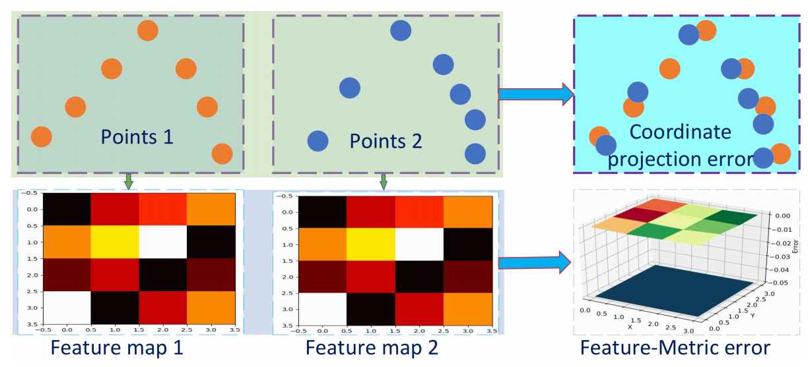

## Feature-metric Registration: A Fast Semi-supervised Approach for Robust Point Cloud Registration without Correspondences
### CVPR2020
### Xiaoshui Huangm (University of Sydney)
[Paper implementation Link - not found yet](.)

##### Why did I read this paper?
* Point cloud Registration without correspondences (and using features only) seemed like an interesting idea.
* One of my area of research

#### Paper keywords / Context
Point cloud registration, Point cloud registration without correspondences, feature metric correspondence, Chamfer distance

***

#### What problem does this paper try to solve?
Proposes to solve the point cloud registration problem without feature correspondences. This is under the primitive that the feature difference of two point clouds should be the smallest if they align well. 

***

#### Main contributions of the paper
A feature-metric point cloud registration framework to solve registration without searching correspondences
* as-is

Semi-supervised approach to train the registration framework.
* The encoder-decoder is trained in an unsup manner, using chamfer distance.
* Explanation on chamfer distance:
  * [Link on stackoverflow](https://stackoverflow.com/questions/3437688/how-to-use-chamfer-matching-algorithm-for-finding-similar-images)
  * Chamfer Distance (CD) is a evaluation metric for two point clouds. It takes the distance of each points into account. For each point in each cloud, CD finds the nearest point in the other point set, and sums the square of distance up. It is utilized in Shapenet’s shape reconstruction challenge.
  * "nearest" point refers to actual distance, not the feature distance

***

### Key figures of the paper

**Coordinate based registration vs Feature metric registration**| Top shows the best alignment can never be achieved, since this (the best) alignment has no point-point correspondences. Feature metric registration can achieve the best performance since it optimizes feature difference without correspondence.
* Not quite agreeable. Although the best alignment may have no point-point correspondences, it can still be achieved using point-point correspondences?

**High-level Overview of the proposed registration framework**| Using the updated transformation parameters, the input point cloud Q is transformed and the whole process iteratively runs.
***

#### Paper Highlights
* The principle of the proposed method is that the feature difference of two-point clouds should be smallest if they align well.
* The goal of this encoder-decoder branch is that the features of two copies of the same point cloud should be different if they have a spatial transformation change and the features must be the same if the  transformation change is removed.
* The second branch is a feature-metric registration which estimates a transformation matrix between two input point clouds by minimizing the feature difference.
* The main principle of designing the encoder network is that the generated feature should be rotation-attentive so that it can reflect the rotation difference during the transformation estimation. We discard the input transform and feature transform layers from PointNet to make the feature aware of the rotation difference.
***

#### New approach/technique/method used in this paper 
The idea to register point clouds using the feature-metric distances only
* Features of same point clouds with the same rotation and translation should have the same features, and different features otherwise.
* Make use of chamfer distance

***
#### Datasets Used
ModelNet40
* 3D CAD models from 40 categories
* 20 categories for training and same-category testing
* 20 categories for cross-category testing

7Scene
* Kinect RGB-D dataset on indoor environment.
* 7 scenes inlcluding chess, fire,s, heads, office, pumpkin, redkitchen and stairs.

***
#### Experiment - Takeaway
Experiment 1 : Evaluation on ModelNet40
* SoTA (at the time)
* Best even under high density difference (at 1/10 of initial density)
  * Can random removal of 90% indicate a 10% density?
* Best even under noise evaluation (but very marginal, and only when initial rotation angle is high)
  * Gaussian noice at ratio 0.01, 0.02. Therefore, the noise is not very drastic.
* Unsupervised shows to perform better than semisup (using GT transformation matrix) :: GT transformation harms performance? 
  * No explanation given to "WHY"

Experiment 2: Evaluation on 7Scenes
* SoTA (at the time, compared to 3DsmoothNet, PointNetLK, and LM-ICP)
* SoTA at a very high margin though
* Faster, too
* (Qualitatively) Effective under partial overlap as well
  * However, the partial overlap argued here is just point clouds by removing part of scans or some objects inside the scans.
  * 3DMatch now uses datasets with minimum 30% overlap, which is much more challenging and more befitting for "partial overlap"d

***

#### Inputs and Outputs 
Inputs:
* Two point clouds
* Feature extracted

Outputs:
* Estimated transformation parameters

***

#### Loss function (Objective function)
Unsupervised: Chamfer distance loss
* Same point cloud to output same features
* Different point clouds to output different features
* A papier-mache approach to learning 3d surface generation. In CVPR 2018

Supervised: Euclidean distance between the 3D points between GT and predicted transformation
* averaged over the number of points

***

#### Evaluation Metrics Used
Ex) MSE, PCK, MAP...
* The equation for the metric
* The characteristics of the metric
* Where this metric is widely used (first use if possible)

***

#### Conclusion and Future work
Only if applicable

***

#### References worth following/noticing
[Reference name 1](link)
* Short explanation

[Reference name 2](link)
* Short explanation

***

#### Assume I am a reviewer: Strengths and weaknesses, what could have been better?
Notes on correctness
* Is the term partial overlap being used correctly? The paper seems to be proposing only one type of partial overlap experiments.
* The point cloud, to begin with, may have very small overlap in the first place (3Dmatch)

Notes on Clarity
* The paper is clear and easy to understand, but
* The English is very poor, with many grammatical mistakes.

Question I may want to ask the author
* Within the context

Figures - well labeled? with error bars?
* Well labeled with error bars. 
* Not extensively searched - how about RANSAC? ICP? FGR?

implicit assumptions, missing citations, and potential issues with experimental or analytical techniques?
* Implicit assumption: The point clouds have no partial overlap, but full overlap.

How could I improve this paper?
* I will start by stating why chamfer distance is used (which is not mentioned in this paper, just referred)
* By experimenting and integrating better techniques to better handle partial overlap
* Comparison against more baselines
* Evaluation on more datasets
* Quantitative on KITTI
* Try to make the process NOT iterative.