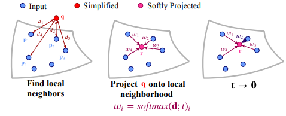
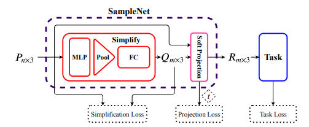
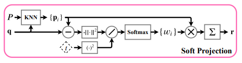
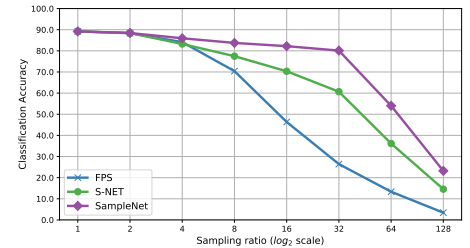
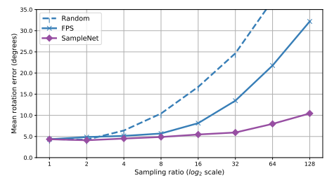

## SampleNet: Differentiable Point Cloud Sampling
### CVPR 2020
### Itai Lang (Tel Aviv University)
[Paper implementation Link](https://github.com/itailang/SampleNet)

##### Why did I read this paper?
Point sampling is a fundamental step in processing point clouds, since there are too many points in a point cloud. 

#### Paper keywords / Context
Point sampling, differentiable point cloud sampling, task-specific point cloud sampling, efficient point cloud processing

***

#### What problem does this paper try to solve?
As the size of the point cloud grows, the computational demands (and thus the processing time) also increases. A common solution is to sample the point cloud to reduce the number of points. Classic sampling methods, such as Fartest Point Sampling, do NOT consider the downstream task. Recently, it was shown that learning to sample point clouds in a task-specific way can improve the results significantly. This paper introduces a novel DIFFERENTIABLE relaxation for task-specific point cloud sampling. 
***

#### Main contributions of the paper
Differentiable relaxation of task-specific point cloud sampling
* the matching step (Nearest neighbour) in prior work is not differentiable 
* switches to weighted average of its nearest neighbours (K-nearest neighbours, average).
  * Does this not result in an ambiguous point?
  * Use temperature parameter to end up with just one candidate point.
  * "In the limit t->0, the distribution converges to a **Kronecker delta function**.

***

### Key figures of the paper

A query (in red) is projected onto its local neighborhood from the input point cloud (blue). A weighted average of the neighbors form a softly projected point (magenta). The weights are optimized to approximate the NN sampling at inference time.

Task network is pretrained. SampleNet is trained to sample points from P that are optimal for the task at hand.

Input point cloud P, simplified point cloud Q. Each point q in Q is projected onto k nearest neighbours in P. Neighbours are weighted by their distance from q and a temperature coefficient t, to obtain r in soft projected point set R.

PointNet used as task network. Pretrained on complete point clouds (1024 points). Evaluted on test split of ModelNet40. The reciprocal of sampling ratio is multiplied to the original number of points to result in FINAL number of points. Outperforms baseline sampling methods with large gap.

PCRNet used as the task network for registration. Trained on car category in MOdelNet40. SampleNet achieves lowest MRE for all ratios.

***

#### Paper Highlights
Multiple short sentences, preferably not more than 10. Some highlights (more important than key points) that are worth noting. Probably the most important section, lest the paper will have to be read again.

***

#### New approach/technique/method used in this paper 
No method seems particularly novel, except the endeavor to make the sampling method differentiable
* **Kronecker delta function**, located at the nearest neighbour point
* Nearest neighbour selection can be viewed as a variation of projection under the **Bregman divergence**.
  * where can I learn these formulations

*** 

#### Outline of the method
* Task network is pretrained on complete point clouds of n points and then frozen
* SampleNet takes a complete input P and simplifies it via a neural network to a smaller set Q of m points.
* Q is soft projected onto P by a differentiable relaxation of nearnest neighbour selection.
* Finally, the output of SampleNet, R, is fed to the task.

***

#### Datasets Used
Classification, Registration: **Modelnet40**
* No explanation within paper

Reconstruction: **ShapeNet Core55**
* Four shape classes with the largest number of examples used
* Table , Car, Chair, Airplane

***

#### Experiment - Takeaway
Experiment 1 : Classification after sampling
* SoTA

Experiment 2: Classification with simplified (before weighting) vs softly projected (before sampling) vs Sampled points
* Softly projected points closely approximate the accuracy achieved by the sampled points

Experiment 3: Temperature profile
* Exponential profile > Learned profile / Linear recitified profile
* Better in the sense the the teperature drops to a lower value (better approximating NN)

Experiment 4: Registration
* Car category only.
* SampleNet achieves the lowest MRE for all ratios

Experiment 5: Reconstruction
* Reconstructed from sampled points. 
* Starting from ratio 8, SampleNet achieves lower error, with an increasing gap in the sampling ratio

***

#### Inputs and Outputs 
Inputs:
* Input point cloud(s)
* Pretrained task network

Outputs:
* Task-specific output
***

#### Loss function (Objective function)
Loss 1: Simplification Loss
* Average nearest neighbour loss (Mean of distance between smallest distance points)
  * such that the sampled points are close to those of P.
* Maximal nearest neighbor loss
  * to minimize the maximum distance between points
* Formulate using the above two losses

Loss 2: Projection Loss
* square of temperature (t^2)
* Since smaller t facilitates Nearest Neighbor
* weight(of each neighbour) is formulated somewhat like softmax, over K nearest neighbours. Each term being:
  * e ^ (-d^2 / t^2)
  * as this t approaches 0, converges to a Kronecker delta function (1 at one position, 0 everywhere else.)

Loss 3: Task Loss
* Specific to the task+
***

#### Evaluation Metrics Used
* Classification: Accuracy (against sampling ratio. Higher the sampling ratio, lower the number of points)
* Registration: Mean rotation error (degrees)
* Reconstruction: Normalized Reconstruction error (formulation not in paper)

***

#### Conclusion and Future work
Key challenge was to deal with the non-differentiability of the sampling operation. 

Failure case: SampleNet achieves lower Normalized Reconstruction Error (NRE) for chair, car, and table classes/..
* BUT FPS is better for airplanes.
* FPS samples more points on the wings than SampleNet.
* These points are important for reconstruction of the input.
* conclusion: sometimes the uniform sampling by FPS is preferred.

Future work: A unified sampling scheme, better in all cases?

***

#### References worth following/noticing
* PointNetLK (CVPR 19)
* DeepICP (ICCV 19)
* Neural Nearest Neighbors Networks. (Neurips18)
* Deep Hough Voting for 3D Object Detection in Point Clouds.
* PointRCNN: 3D Object Proposal Generation and Detection from Point Cloud. (CVPR 19)
* PU-Net: Point Cloud Upsampling Network (CVPR 18)
* PCN: Point Completion Network (3DV 18)
* 3D Point-Capsule Networks (CVPR 19)
***

#### Assume I am a reviewer: Strengths and weaknesses, what could have been better?
Notes on correctness
* seems correct
* Not enough mathematical knowledge to say for sure

Notes on Clarity
* Clear enough to understand

Figures - well labeled? with error bars?
* Well labeled
* But no error bars
* Are error bars even necessary? (haven't really seem them)

How could I improve this paper?
-