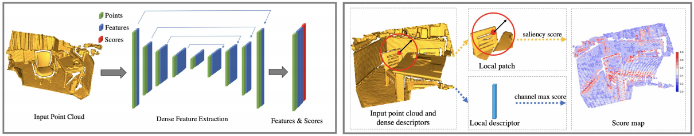
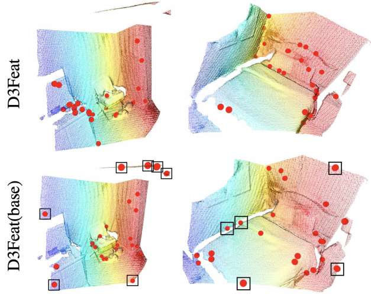

## D3Feat: Joint Learning of Dense Detection and Description of 3D Local features
### 2020 CVPR Oral
### Xuyang Bai, Zixin Luo, Lei Zhou, Chiew-Lan Tai (HKUST, City University of HK)
[Paper implementation Link](https://github.com/XuyangBai/D3Feat)

##### Why did I read this paper?
Partly implemented in current area of research (3D matching)
* Also shows a direct improvement compared to FCGF (in the paper itself)

#### Paper keywords / Context
3D matching, Dual learning of feature detection AND description, 3D feature detection, feature scoring mechanism

#### What problem does this paper try to solve?
Little attention has been drawn to the leasrning of 3D feature **detectors**(not descriptors), even less for a joint learning of the two tasks. Most previous works just randomly sample a set of points for feature description, which can be poorly localized (and thus causing inaccurate transformation estimates during geomtric verification such as RANSAC), and may appear in non-salient regions liuke smooth surfaces(resulting in indiscriminative descriptors). 

This paper seeks for a joint learning framework that is able to not only predict keypoints densely, but also tightly couple the detector with a descriptor with shared weights for fast inference. 

#### Main contributions of the paper
Adopt a **joint** learning framework for 3D local feature detection and description by leverating a fully convolutional network based on **KPConv**.
* Instead of dual structures, resulting in faster inference
* KPConv is a newly proposed convolutional operation on 3D point clouds, to build a fully convolutional network to consume an unstructured 3D point cloud directly.

A novel density-invariant keypoint selection strategy
* if density-variant, the less dense points have a higher score (and thus a higher prob) of being selected as a feature
* a key to obtaining repeatable (!=reliable) keypoints for 3D clouds

Self-supervised detector loss that receives meaningful guidance from the on-the-fly feature matching results during training, which guarantees the convergence of tightly coupled descriptor and detector
* (after reading the paper) High on-the-fly scores on feature matching means an easy feature match, which is obviously the more preferred features as a result.

### Key figures of the paper

* Left) Network architecture of D3Feat. Each block is a ResNet block using KPConv to replace image convolution. 
* Right) Keypoint Detection. Apply saliency score and channel max score to calculate keypoint detection scores. 

* Visualization of 3D match. First row detected using D3feat, while second row detected using naive local max score. Using D3feat yields points that are not close to the boundaries (and thus are more repeatable, more likely to be discriminative).

#### Paper Highlights
* The first work  to handle Dense Detection and Description of 3D local Features : thus 3DFeat
* If we simply use a softmax function to evaluate the local maximum in the spatial dimension, that local regions with few points would inherently have higher scores. -> Calls for density-invariant keypoint selection strategy
* Dense keypoint detection: the most preeminent channel is first selected, and then verified by whether or not it is a maximum of its spatial local neighbourhood on that particular response map.
* The saliency score is calculated as the difference between its feature and the **mean** feature of its local neigbourhood
* We seek for a loss formulation that encourages the easily matchable correspondences to have higher keypoint detection scores than the correspondences which are harder to match. -> on the fly approach, if a correspondence is already matchable under the current descriptor network, we want the score to be higher and vice versa.
* It is also noteworthy that, regarding Inlier Ratio, D3Feat is the ONLY method that achieves improved results when smaller number of points is considered.
* **PerfectMatch**(a different work) is the best performing method, due to the use of **SDV(smoothed density value) representation**. (In ETH dataset, while experimenting the generalizability)

#### New approach/technique/method used in this paper 
Formulation of density-invariant keypoint selection 
* Usage of average instead of sum prevents the score from being affected by the number of points in the neighbourhood(density-invariant)
* Measures relative saliency of a center point with respect to that of the supporing points in the local region.

Detector loss: which provides explicit guidance for the score term
* Makes use of on-the-fly feature matching results to evaluate the discriminativeness of each correspondence. 
* i.e. if already matchable correctly (using neareat neighbor search), increase the corresponding scores for each of the points to be higher.
* The descriptor loss utilizes the contrastive loss, but this concept was also well leveraged in FCGF, not making it a new approach (novelty).

#### Noteworthy Experiment - Takeaway
Point Cloud Registration: 3DMatch(Indoor) and Kitti(outdoor)
* RANSAC is still used (50,000 iterations) to estimate the transformation metrics, even with SoTA detectors and descriptors
* D3feat achieves the best performance, enhanced when a **learned detector is equipped**

Performance of Point cloud registration under different number of keypoints (3DMatch)
* Regarding Inlier Ratio, D3Feat(pred) is the only method that achieves improved results when smaller number of points is considered.
* strongly indicates that the detected keypoint have been properly ranked, and the top points receive higher probability to be matched (a desired property, expected of a reliable keypoint)

Rotation Invariance (3DMatch)
* As shown in FCGF, find that a fully convolutional network (KPConv here) is able to empiricallyt achieve strong rotation invariance through low-cost data augmentation.

KITTI dataset, comparison to FCGF
* Even using only 250 points, D3Feat still achieves 99.63% success rate, while FCGF drops to 68.62% due to the lack of a reliable detector.

Outdoor settings: ETH dataset (trained on Kitti, testing for generalizability)
* **PerfectMatch** is still the best performing method
  * its generalizabilty can be ascribed to the use of **smoothed density value (SDV)** representation. (TO-READ)
* Generalizability still improves with the paper-proposed detector

Keypoint Repeatability:
* USIP and D3Feat use differnet processing and splitting strategies and USIP requires surrfac enormal and curvature as input, the results are not directly comparable.
* D3Feat generally outperforms all the other detectors on 3DMatch and KITTI dataset over all different number of keypoints except worse than USIP on KITTI.

#### Inputs and Outputs 
Inputs:
* 3D pointcloud itself

Outputs:
* Transformation matrix after running RANSAC
* Keypoints with corresponding scores (and thus can select top-k sort)

#### Loss function (Objective function)
Descriptor loss
* utilize contrastive loss, gives better convergence performance
* therefore optimizes in a way to minimize distance between positive samples, and maximize distance to hardest negative sample outside the safe radius
  * safe radius : considering spatial locality, a nearby feature being classified as a negative is likely to be a False negative.

Detector loss
* Product of (sum of (dpos - dneg)) and (sum of (scores of two points of a match))
  * Therefore, if dpos - dneg is negative, will learn to increase the scores of the corresponding points

Q. How are the scores of a point calculated?
A. The product of **density-invariant saliency score** and **channel max score**
* Refer to paper for more details
* "..the most preeminent channel is first selected, and then verified by whether or not it is a maximum of its spatial local neighborhood on tha tparticular response map D^k"

#### Evaluation Metrics Used
**Indoor Settings**

Feature Matching Recall
* the percentage of successful alignement whose inlier ratio is above some threshold

Registration Recall
* the percentage of successful alignment whose transformation error is below some threshold

* The equation for the metric
* The characteristics of the metric
* Where this metric is widely used (first use if possible)

**Outdoor Settings**

Relative Translation Error (RTE), Relative Rotation Error (RRE)

**Keypoint Repeatability**

Relative repeatability (proposed in the USIP paper)

#### Datasets Used
[3DMatch dataset (Indoor)](https://3dmatch.cs.princeton.edu/)
* RGB-D Datasets

[KITTI dataset(Outdoor)](http://www.cvlibs.net/datasets/kitti/)
* Tasks of interest: stereo, optical flow, visual oodometry, 3D objection detection, 3D tracking
* Photos captured from driving around mid-size city

[ETH dataset (Outdoor)](https://projects.asl.ethz.ch/datasets/doku.phpid=laserregistration:laserregistration)

#### Conclusion and Future work
-

#### References worth following/noticing

* PPFNet: Global context aware local features for robust 3d point matching (CVPR 18)
* D2-Net: A trainable CNN for joint desciption and detection of local features (CVPR 19)
* 3D point cloud registration for localization using a deep neural network autoencoder (CVPR 17)
* The perfect match: 3d point cloud matching with smoothed densities. (CVPR 19)
* A comprehensive performance evaluation of 3d local feature descriptors (IJCV 16)
* 3Dfeat-net: weakly supervised local 3d features for point cloud registration (ECCV 18)
* Learning compact geometric features (ICCV 17)
* ContextDesc: Local descriptor augmentation with cross-modality context
* Geodesc: Learning local descriptors by integrating geometry constraints.
* Working hard to know your neighbour's margins: Local descriptor learning loss (NeurIPS 17)
* KPConv: Flexible and deformable convolution for point clouds (ICCV 19)
* LIFT: Learned invariant feature transform (ECCV 16)
* 3DMatch: Learning local geometric descriptors from rgb-d reconstructions (CVPR 17)
* Learning and matching multi-view descriptors for registration of point clouds (ECCV 18, geodesc, contextdesc)

#### Assume I am a reviewer: Strengths and weaknesses, what could have been better?
Notes on correctness
* results seem sound, not expert enough to confirm

Notes on Clarity
* The steps and motivations are clear, some details come without clarification or justification: not sure whether they are conventional or just underexplained.

Question I may want to ask the author
* Why are the descriptors L2-normalized to unit length? Is this a convention simply mentioned, or an approach that calls for ablation?
* Are randomly rotated fragments necessarily more difficult?
* ~~What is implied by the terms "grid size" and "correspondence number"?~~

Terms that I did not understand, and their usage
* grid size, correspondence number

Figures - well labeled? with error bars?
* Figures are well labeled, and well explained.
* Tabular values do not seem to have error bars, nor do the graphs. (Is this always encessary?)

implicit assumptions, missing citations, and potential issues with experimental or analytical techniques?
* Implicit assumptions: do scores really depend on the density without the average term?
* Not sure about missing citations
* Not sure about experimental or analytical techniques