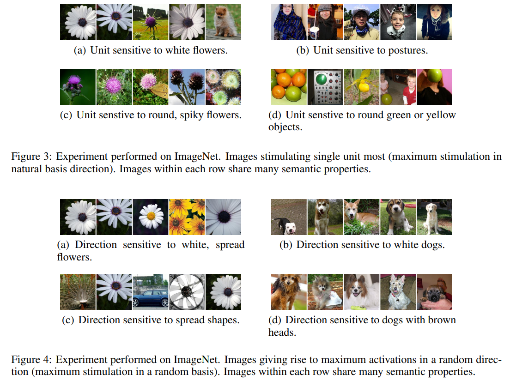
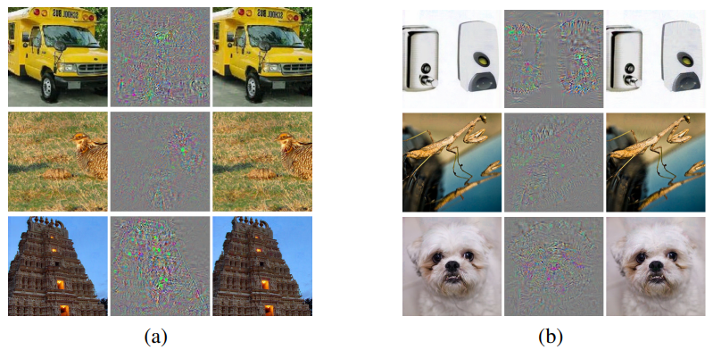

## Intriguing properties of neural networks
### ICLR 2014
### Google Inc, Facebook Inc, New York Uni. Includes Ian Goodfellow
[Paper implementation Link](https://github.com/zjhthu/OANet)

##### Why did I read this paper?
Personal area of interest, may pursue research in this field if it seems fit
* hoping to solve my correspondence applications

#### Paper keywords / Context
Understanding Neural networks, Adversarial Examples, unintuitive characteristics of NN

***

#### What problem does this paper try to solve?
Neural net has high expresiveness, which is the reason why they succeed. However, it also causes them to learn uninterpretable solutions that could have counter-intuitive properties. This paper reports two such properties in this paper, adequately backed with experiments and theory.

***

#### Main contributions of the paper
Find that there is no distinction between individual high level units and random linear combinations of high level units
* It is the space, rather than the individual units, that contains the semantic information in th elayers of neural networks
* This puts question into the notion that neural networks disentangle variation factors across coordinates

Find that deep neural networks learn input-output mappings that are fairly discontinuous to a significant extent
* can cause the network to misclassify an image by appying a certain hardly perceptible pertubation
* The same pertubation can cause a different network, that was trained on a different subset of the dataset, to misclassify the same input

(As an idea for future work) Show that small Lipschitz bounds guarantee that no such (adversarial) examples can appear
* Suggests that a simple regularization of the parameters, consisting in penalizing each upper Lipschitz bound, might help iprove the generalization error of the networks.

***

### Key figures of the paper

Any basis gives rise to interpretable semantic properties, too

Original | Noise | Adversarial, all classified as ostriches
***

#### Paper Highlights
* While NN's expressiveness is the reason they succeed, it also causes them to learn uninterpretable solutions that could have counter-intuitive properties.
* Generally, it seems that it is the entire space of activations, rather than the individual units, that contains the bulk of the semantic information. 
* if we use one neural net to generate a set of adversarial examples, we find that these examples are still statistically hard for another neural network even when it was trained with different hyperparameters or, most surprisingly, when it was trained on a different set of examples.
* The above observations suggest that adversarial examples are somewhat universal and not just the results of overfitting to a particular model or to the specific selection of the training set. They also suggest that back-feeding adversarial examples to training might improve generalization of the resulting models. 
* (Not fully understood) A subtle, but essential detail is that we only got improvements by generating adversarial examples for each layer outputs which were used to train all the layers above. 
* Indeed, if the network can generalize well, how can it be confused by these adversarial negatives, which are indistinguishable from the regular examples? Possible explanation is that the set of adversarial negatives is of extremely low probability, and thus is never (or rarely) observed in the test set, yet it is dense (much like the rational numbers), and so it is found near every virtually every test case. 

***

#### New approach/technique/method used in this paper 
No 'novel' new approach/technique/method, just experimental findings regarding intriguing properties.

A new method to generate adversarial examples
* Create x + r as the closest image to x classified as l (the correct class)
* subject to conditions emphasized in the papers
* **NOTE** this is an old paper, and now there are very systematic ways to get adversarial examples

***

#### Experiment - Takeaway
* MNIST with varying FC settings
* ImageNet Dataset, on AlexNet
* 10~M images samples from youtube, on QuocNet

The natural basis is not better than a random basis for inspecting the properties of f(x), where f is the activation values of some layer.
* any random direction v (in space R^n, not a natural basis) gives rise to similarly interpretable semantic properties, as do natural bases do
* neural networks **do not necessarily disentangle** variation factors across coordinates
* it seems that it is the entire space of activation(rather than individual units) that contains the bulk of the semantic information.

Choose a minimizer r for image x such that (x + r), a slightly pertubed image is obtained. Careful description of the problem and settings are in the paper.
* For all networks studied in this paper, always managed to generate very close, visually hard to distinguish, adversarial examples that are misclassified
* **Cross model generalization**: relatively large fraction of examples will be misclassified by networks trained from scratch with different hyperparameters
* **Cross training-set generalization**: Relatively large fraction of examples will be misclassified by networks trained from scratch on a disjoint training set
* Above observations suggest that adversarial examples are somewhat universal and not just the results of overfitting to a particular model or to the specific selection of the training set.
* Also suggest that back-feeding adversarial examples to training might improve generalization of the resulting models.

***

#### Inputs and Outputs 
Inputs:
* MNIST images
* Youtube images
* ImageNet images

Outputs:
* Adversarial examples, "seeminly undistinguishable"

The created examples are then tested on the same/different models, cross-model, cross-trainig set. The specific results are in the paper.

***

#### Loss function (Objective function)
Classification tasks: Cross-entropy loss

***

#### Evaluation Metrics Used
Classification Accuracy
* Correctly classified / Total test data

Distortion (adversarial)
* sqrt(mean of square of pixel differences)
* Not used to show the efficacy, but to show the **minimum average pixel level distortion necessary** to reach 0% accuracy on the training set.

***

#### Datasets Used
MNIST, ImageNet, Youtube

***

#### Conclusion and Future work
* How often do adversarial negatives appear? left for future work
* Deep nns have counter-intuitive properties both wrt semantic meaning of individual units and wrt their discontinuities
* existence of adversarial negatives appears to be in contradiction with the network's ability to achieve high generalization performance.

***

#### References worth following/noticing
[Visualizing and understanding convolutional neural networks](https://arxiv.org/abs/1311.2901)

***

#### Assume I am a reviewer: Strengths and weaknesses, what could have been better? (except typos)
Since this is an ICLR paper, partially attributed to [OpenReview](https://openreview.net/forum?id=kklr_MTHMRQjG)
* 'the set of adversarial negatives is of extremely low probabilities' - did you show this?  
* When you say 'Our experiments show that ... properties.'...  I don't think what you are talking about is really a scientific experiment.  It's something anecdotal and informal.
* The other way round of this phenomenon ie drastic change to the human eye but no change to the machine is already in use as the basis of a very popular edge extractor, 'Edge detection with embedded confidence' by Peter Meer. And such behaviour is sort of expected from a deep network because the final layer neurons when projected back to the visual input nodes using Deconvolution networks are mostly edge-profiles of the objects and thus making small adversarial changes to them is expected to alter the final classification output. 
