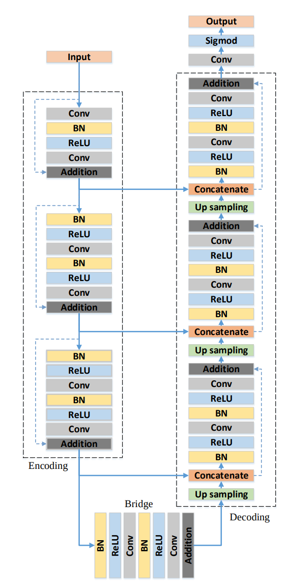
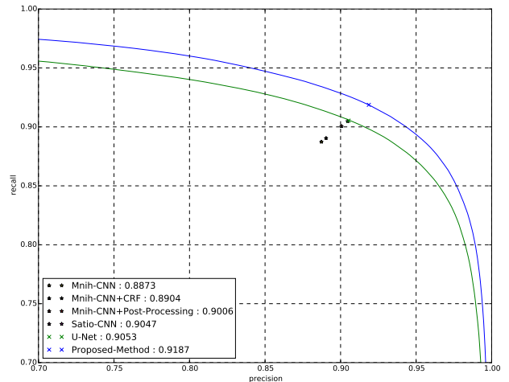

## Road Extraction by Deep Residual U-Net
### IEEE 2017 (Geography, not computer science)
### Member/Senior members of IEEE

##### Why did I read this paper?
Appears a lot in Medical and 3D Matching context, wanted to know what (residual) U-net is.

#### Paper keywords / Context
Residual network, U-net, skip connections, cross-layer concatenations to leverage both low/high layer data

***

#### What problem does this paper try to solve?
Targets to improve performance on road semantic segmentation, by applying **Residual learning** to **U-nets**.

***

#### Main contributions of the paper
Leveraged Residual Learning together with U-nets
* U-net: concatenates lower layers to higher layers (in a U-shaped network, illustrated later on)
* residual learning: enables deeper layers, more efficient learning

***

### Key figures of the paper

Architecture of the proposed ResUNet: dotted lines are skip connections(Res), solid lines across layers are the concatenation layers(UNet)

Relaxed PR Curve, annotated with break-even points.

***

#### Paper Highlights
* Although the parameters of our network is only 1/4 of U-Net (7.8M versus 30.6M), promising improvement are achieved on the road extraction task.
* This combination (ResNet and U-Net) brings two benefits:
  * The residual unit will ease training of the network
  * the skip connections within a residual unit and between low levels and high levels of the network will faciliate niformation propagation without degradation, maing it possible to design a neural network with much fewer parameters however achieve comprable ever better performance on semantic segmentation

***

#### New approach/technique/method used in this paper 
The combination of residual connections with U-net structure.

The usage of PR-Curve break-even point as a metric to prove superiority
* Is this a convention? How meaningful is this?

***

#### Experiment - Takeaway
Semantic segmentation results
* ResUNet outperforms all previous models

***

#### Inputs and Outputs 
Inputs:
* Aerial road images, cropped into patches
* Because the segmentation results are unstable near the edges of the image (due to padding), the cropped images have an overlap of 14 pixels on all sides (empirical value, I think)

Outputs:
* Per-pixel class label predictions

***

#### Loss function (Objective function)
Mean Squared error between **generated segmentations** and **ground truth**, averaged over NUMBER OF IMAGES 
* error is calculated as L2 norm, per-pixel differences probably

***

#### Evaluation Metrics Used
Relaxed precision and Recall scores
* Relaxed precision: Fraction of number of pixels predicted as road within a range of p pixels from pixels labeled as road (relaxed by p pixels)
* Relaxed recall: Fraction of number of pixels labeled as road that are within a range of p pixels predicted as road
***

#### Datasets Used
Massachusetts roads dataset
* 1171 images
* 1108 training, 14 validation, 49 testing (what is with this balance)
* 1500X1500 pixels
* crossing from urban, sub-urban to rural areas and a wide range of ground objects (roads, rivers, sea, vegetations...)

***

#### Conclusion and Future work
-

***

#### References worth following/noticing
-
***

#### Assume I am a reviewer: Strengths and weaknesses, what could have been better?
The idea of combining Residual learning and the U-net structure is OK, but not novel.

The writing is very poor - the paper is very easy to follow, and the sentences are not disturbingly misleading, but prone to grammatical errors

Is the break-even point of PR curve a conventional metric? Why does this necessarily mean that the results are superior?

Why are there no comparisons in mIOU