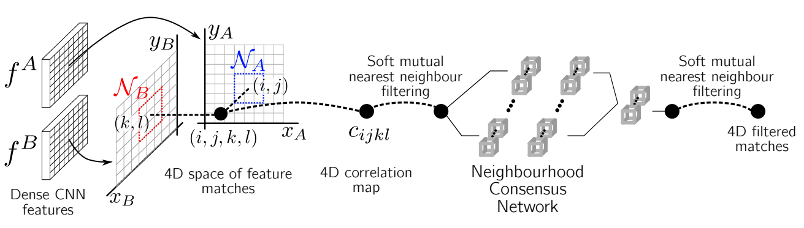

## Neighbourhood Consensus Networks
### 2018 NeuRIPS
### Ignacio Rocco (Inria, DeepMind, Tokyo Institute of Technology)
[Paper implementation Link](https://github.com/ignacio-rocco/ncnet)

##### Why did I read this paper?
Prior to reading and understanding CHMNet
To understand the motivation and flow of logic from NCNet->SparseNCNet

#### Paper keywords / Context
Neighborhood Consensus(Semi-local constraints), 4D convolution, fully end-to-end, Soft NN filtering, Weakly supervised learning

***

#### What problem does this paper try to solve?
Finding reliable dense correspondence between pair of images is challenging. Disambiguating feature matches using semi-local constraints is a classic idea, and this paper proposes to **learn** the semi-local constraints. To do so, full set of correspondences are computed (h X w X h X w tensor, 4D), where 4D convolution is performed, followed by several differentiable operations to yield final set of correspondences. 

***

#### Main contributions of the paper
End-to-end trainable CNN analyzing neighborhood consensus patterns in the 4D space of all possible correspondences
* Before, semi-local constraints were applied after computing the feature correspondences, in a heuristic way. 
* Now proposes to **learn** the semi-local constraints **upon** computing feature correspondences.

Weakly supervised training
* Just need to know if a pair of images can be matched or not
* Full supervision is hard to achieve, since unable to create annotattions for all possible correspondences in 4D space

SoTA on category-level(semantic) matching and instance-level(geometric) matching
* PF Pascal, and InLoc

***

### Key figures of the paper

ResNet to extract dense descriptors (pretrained). All pairs of feature matches are constructed in 4D space, processed by soft-nearnest neighbour filtering and neighbourhood consensus network.

***

#### Paper Highlights
* The intuition is the following: in order to disambiguate a match on a repetitive pattern, it is necessary to analyze a larger context of the scene that contains a unique non-repetitive feature. 
* In other words, the certain unique matches will support the close-by uncertain ambiguous matches in the image.
* The decision on matching assignment is done only after taking into account the spatial consensus constraints, hence avoiding errors due to early matching decisions on ambiguous, repetitive or textureless matches.
* The widely used second nearest neighbour ratio test, or enforcing matches to be mutual NN work well for many applications, but have the disadvantage of **discarding many correct matches**.
* Finally, in order to produce a method that is invariant to the particular order of the input images(same matches regardless of whether an image pair is input in any order), the network is applied twice: once on the correlation tensor c, once on the **transpose** of the correlation tensor c, where the result is transposed again. The two results are added.
* Although the proposed neighbourhood consensus network can suppress and amplify matches at a semi-local level, it cannot enforce global constraints on matches.
* Two typical failure modes: Repetitive patterns combined with large changes in scale, locally geometrically consistent groups of incorrect matches.
***

#### New approach/technique/method used in this paper 
Applying the network twice to ensure order invariance
* Once on correlation tensor c, once on c^T
* The two results are added

Soft mutual NN
* Instead of sending the weights to 0 for all non-nearest neighbours
* send the weights to the ratio of each weight over the maximum weight
* the actual NN has weight 1, since (max weight / max weight).
* This makes the NN constraint differentiable

Weakly supervised loss
* In depth in the losses section

***

#### Experiment - Takeaway
Experiments on InLOC and PF-Pascal
* Achieves SoTA

***

#### Inputs and Outputs 
Inputs:
* Pair of images to be matched
* Can be categorical-level matching or instance-level matching 

Outputs:
* Correspondence scores
* Argmax can be taken to retrieve correspondences (referred to as "extracting correspondences from the correspondence map")

***

#### Loss function (Objective function)
Weaksup loss : -y (sA + sB)
* y = 1 for matchable pair, -1 for unmatchable pair
* sA and sB are the mean matching scores over all hard assigned (argmax) matches, A and B denoting opposite matching directions.
* The score is calculated using soft-max in the dimensinos corresponding to images A and B
* Matchable pair: maximize score, Unmatchable pair: minimize scores

***

#### Evaluation Metrics Used
Categorical-level matching:
* PCK: Percentage of correctly transferred keypoints within threshold 

Instance-level matching
* Percentage of correctly localiszed queries within a given distance(m) and 10 degrees angular error
***

#### Datasets Used
PF-Pascal
* 1,351 semantically related image pairs from 20 object categories of PASCAL VOC dataset.

InLoc dataset
* 10K database images extracted from 227 RGBD panoramas

Indoor Venues Dataset
* Collected by authors
* consists of user-uploaded photos, captured at public places (restaurants, cafes, museums...)
* crawled from Google Maps
* 3861 image pairs, 3481 pairs(80 places) for training, 380 pairs (remaining 9 places) for validation

***

#### Conclusion and Future work
Limitations:
* fails in repetitive patterms combined with large changes in scale
* fails in locally geometrically consistent groups of **incorrect** matches
* quadratic complexity w.r.t number of image pixels, limiting the resolution images that can be handled.
* More in-depth in SparseNCNet paper.

***

#### References worth following/noticing
* UCN, SCN 
* Convolutional neural network architecture for geometric matching
* LIFT
* Large-scale image retrieval with attentive deep local features

***

#### Assume I am a reviewer: Strengths and weaknesses, what could have been better?
Notes on correctness
* Fair reasoning, novel motivation

Notes on Clarity
* Very clear, easy to follow. Some typos could be fixed.

Terms that I did not understand, and their usage
* listed in other repository

Figures - well labeled? with error bars?
* Well labeled, no error bars.

implicit assumptions, missing citations, and potential issues with experimental or analytical techniques?
* not expert enough to know