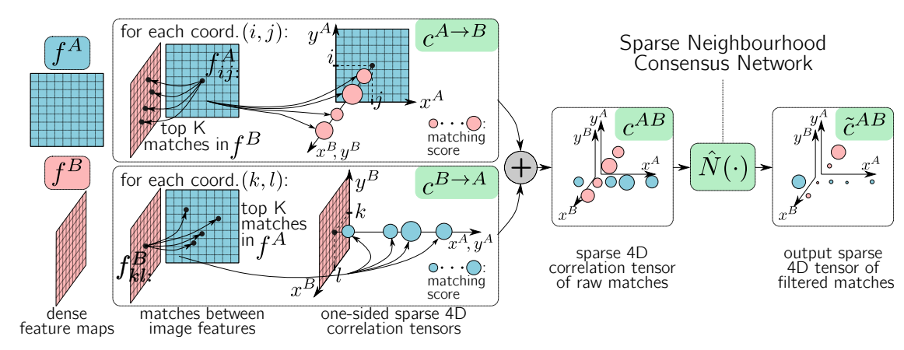
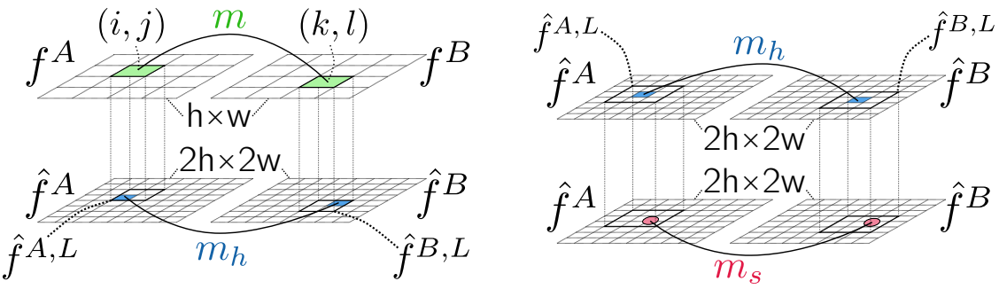

## Efficient Neighbourhood Consensus Networks via Submanifold Sparse Convolutions
### 2020 ECCV
### Ignacio Rocco (Inria, DeepMind)
[Paper implementation Link](https://github.com/ignacio-rocco/sparse-ncnet)

##### Why did I read this paper?
Prior to reading and understanding CHMNet
To understand the motivation and flow of logic from NCNet->SparseNCNet

#### Paper keywords / Context
Sparse tensor and sparse convolution, NCNet, Match relocalization

***

#### What problem does this paper try to solve?
NCNet has three main problems: large memory consumption, large inference time and poorly localized correspondences. This paper aims to solve these problems by using sparse representations of feature correspondences, and correspondingly, sparse convolution as well. (Referred to as submanifold sparse convolutions) Furthermore, for application areas where subpixel accuracy is crucial, this paper also proposes a novel two-stage relocalisation module to minimize the localisation error of features.

***

#### Main contributions of the paper
Sparse representation and computation of neighborhood consensus
* Done using Minkowski Engine

Two-stage relocalisation module
* For better localization of features
***

### Key figures of the paper

Outline. Very similar to NCNet, except that just top K matches are used (induce sparsity), and soft NN is not performed.

Two-stage relocalisation module. Soft relocalization refines the position of matches in 2h x 2w grid, by computing sub-feature-grid soft localization displacements based on the softargmax operation.

***

#### Paper Highlights
* Localization accuracy is significantly improved by processing the input images in higher resolution, which is possible due to reduced memory footprint.
* ..Based on a 4D CNN operating on a sparse correlation tensor, which is obtained by storing only the **most promising** correspondences, instead of the set of all possible correspondences.
* We have removed the soft mutual NN operation, as we noticed its effect was not significant when operating on the sparse correlation tensor.
* We propose a two-stage relocalisation module based on the idea of guided search

***

#### New approach/technique/method used in this paper 
Using top-k matches (as opposed to NCNet) to induce sparsity
* Less memory overhead
* Enables higher resolution
* K=10

Two-stage relocalisation module
* for better relocalization. The figure and caption is self-explanatory.

***

#### Experiment - Takeaway
Note: sparsity enables high resolution feature map dimension.
SoTA on HPatches, InLoc benchmark 
* When using sparse + higher resolution + hard AND soft relocalization
* bloUsing sparse + same resolution itself yields similar results to original NCNet. Lighter, faster, but similar results.

Competitive results on Aachen Day-night
* Question) COLD evaluated only on the night split. is this okay?
* Saturated on lenient thresholds

Implemented using PyTorch, Minkowski Engine, Faiss

The feature extractor is fixed (In NCNet, was finetuned.) -> Not end-to-end pipeline anymore.

***

#### Inputs and Outputs 
Inputs:
* Pair of images to be matched
* Question) Why not experimented/evaluated on semantic matching datasets? Maybe not as effective on semantic matching benchmarks?

Outputs:
* Correspondence scores
* Argmax can be taken to retrieve correspondences (referred to as "extracting correspondences from the correspondence map")

***

#### Loss function (Objective function)
Weaksup loss : -y (sA + sB)
* y = 1 for matchable pair, -1 for unmatchable pair
* sA and sB are the mean matching scores over all hard assigned (argmax) matches, A and B denoting opposite matching directions.
* The score is calculated using soft-max in the dimensinos corresponding to images A and B
* Matchable pair: maximize score, Unmatchable pair: minimize scores

***

#### Evaluation Metrics Used
Mean Matching Accuracy (MMA)
* assess the fraction of correct matches under different tolerance thresholds
* Ground truth homography vs predicted, within threshold?

Correctly localised queries
* by varying distance thresholds

***

#### Datasets Used
HPatches sequence
* 108 image sequences, each from different planar scene, each containing 6 images
* First image from each sequence is matched against the remaining 5 images.
* 56 sequences with viewpoint changes, 52 sequences with illumination changes (otherwise constant)

InLoc Benchmark
* Database images of a building obtained with 3D scanner
* Task is to obtain 6-dof camera positions of the queries

Aachen Day-Night
* targets 6-dof outdoor camera localisation under challenging illumination conditions
* 98 night-time iamges, 20 day-time images
* Matches -> COLMAP -> estimated query poses

***

#### Conclusion and Future work
-

***

#### References worth following/noticing
-
***

#### Assume I am a reviewer: Strengths and weaknesses, what could have been better?
Notes on correctness
- seems to be correct upon explanation

Notes on Clarity
- easy to read and follow, except for the relocalisation module. The equations are not very clear to understand.

Question I may want to ask the author
- in the summary itself. Mainly: does this method not work for semantic matching module?

Figures - well labeled? with error bars?
- well labeled, no error bars

implicit assumptions, missing citations, and potential issues with experimental or analytical techniques?
- not expert enough to know
