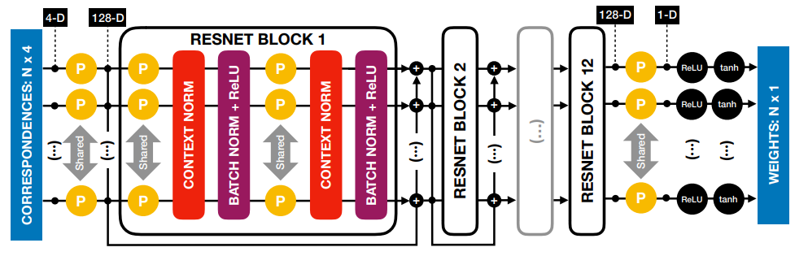
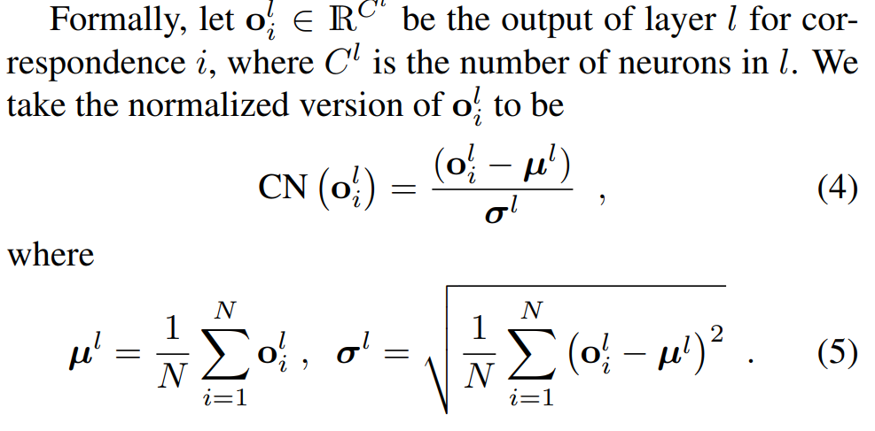

## Learning to Find Good Correspondences
### CVPR 2018
### Kwang Moo Yi (Visual Computing Group, UVic | CVLab Ecole Polytechnique | Sony)
[Paper implementation Link](https://github.com/vcg-uvic/learned-correspondence-release)
* Note: Tensorflow

##### Why did I read this paper?
Current area of research, and has been cited a lot in the papers I have read

#### Paper keywords / Context
Permutation equivariance, Context normalization, PointNet-like structure, Outlier rejection

***

#### What problem does this paper try to solve?
Outlier rejection among candidate correspondences. Propose a novel approach to finding geometrically consistent correspondences with a deep network.
Introduces a normalization technique (Context normlization), processing each data point separately while embedding global information in it (and making the network invariant to the order of correspondences)

***

#### Main contributions of the paper
Context Normalization
* normalizes intermediate outputs by average and variance
* This normalization takes place per image pair (unlike batchnorm and other norms, usually for speedups)
* "Encodes camera motion and scene geometry"

Weak supervision through essential matrices for training
* No need for strong supervision (which is hard to get anyway)
* Works effectively with very little training data. Outperformed SoTA then with only 59 training images.

***

### Key figures of the paper

Takes N correspondences between two 2D points as input. Produces weight for each correspondence. Each correspondence is processed independently. Global information is embedded by Context Normalization (instead of aggregating global features as in PointNet)

Non-parametric context normalization. Normalize each perceptron's output across correspondences, but separately for each image pair. 

***

#### Paper Highlights
In practice, we assume the camera intrinsics to be known, which is often true because they are stored in the image meta-data. The camera motion is expressed in terms of essential matrix.

Our architecture relies on MLPs that are applied independently on each correspondence, rendering the network invariant to the order of the input. This is inspired by PointNet.

We use camera intrinsics to normalize the coordinates to [-1,1], which makes the optimization numerically better-behaved.

By contrast, the other normalization techniques primarily focus on convergence speed, with little impact on how the networks operate.

After the last perceptron, we apply a ReLU followed by a tanh to force the output in the range [0,1). We use this truncated tanh instead of eg. sigmoid, so that the nwtork can easily output w=0 to completely remove an outlier.

Weighted eight-point algorithm is used.

We generate the labels y by exploiting the epipolar constraint. Given a point in one image, if the corresponding point in the other image does not lie on the epipolar plane, the correspondence is spurious. Note that this is a weak supervisory signal because outliers can still have a small epipolar distance if they lie close to the epipolar line.

Two losses (classification and regression) are used. Their weights are set to 1 and 0 initially and then to 1 and 0.1 after 20k batches. We first seek to assign reasonable weights to the correspondence before also trying the make the essential matrix accurate.

***

#### New approach/technique/method used in this paper 
Context normalization

***

#### Experiment - Takeaway
Experiment 1 : Classification loss vs Regression loss vs directly regressing essential matrix vs Combination of cls and rgs loss (proposed)
* Combination is the best
* Direct regression of essential matrix is also promising
* Classification alone is also promising

Experiment 2: Global features through Pointnet-like method VS proposed method
* Proposed method (CN) outperforms PointNet-like global features.

Experiment 3: Results on known scenes and unknown scenes(generalization)
* Proposed method outperforms LMEDS, RANSC, MLESAC...etc
* Proposed method experimented with SIFT or LIFT. LIFT is almost always better, but SIFT alone already outperforms all baselines
* **Post-processing with RANSAC saves time (compared to RANSAC alone) and improves the results even further.**

***

#### Inputs and Outputs 
Image:
* Image pair
* From where candidate correspondence are computed using NN search
* These candidate correspondences are used as inputs

Outputs:
* Weights for each correspondence
* The weights are used for weighted 8-point algorithm

***

#### Loss function (Objective function)
Classification loss + Regression loss (essential matrix)

Classification loss
* On weights of the correspondences
* Rejecting outliers
* If the symmetric epipolar distance is within 10-2 in normalized coordinates, a valid correspondence
  * Not always valid, which is why it is referred to "weak supervision"

Regression loss
* from GT essential matrix
* penalize deviations from the ground-truth

In ratio 1:0 in the beginning, to 1:0.1 after 20k batches

***

#### Evaluation Metrics Used
mAP, measured as AUC of precision - threshold curve
* threshold 0 ~ 180 degrees
* "Given two images, it is possible to estimate rotation exactly - in theory - and translation only up to a scale factor."
* AUC calculated up to maximum thresholds of 5, 10 or 20 degrees
  * after this point does not matter how inaccurate pose estimates are
***

#### Datasets Used
Outdoor scenes: YFCC100M dataset
* collection of 100m publicly available Flickr images with accompanying metadata
* later curated into 72 image collections suitable for SfM

Indoor scenes, SUN3D dataset
* series of indoor videos captured with Kinect, with 3D reconstructions.

***

#### Conclusion and Future work
Now requires intrinsics. Could be improved?

***

#### References worth following/noticing
Batch normalization, Layer normalization, Group normalization, Instance normalization

***

#### Assume I am a reviewer: Strengths and weaknesses, what could have been better?
Notes on correctness
* seems correct enough to me.
* Feature similarity scores are not used - is this empirically the best?

Notes on Clarity
* Seems clear enough to me. Well-written.

Question I may want to ask the author
* -

Figures - well labeled? with error bars?
* Well labeled, but no error bars.

implicit assumptions, missing citations, and potential issues with experimental or analytical techniques?
* -

How could I improve this paper?
* -