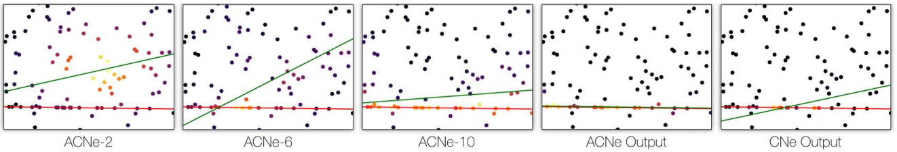
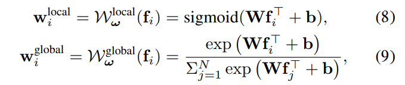
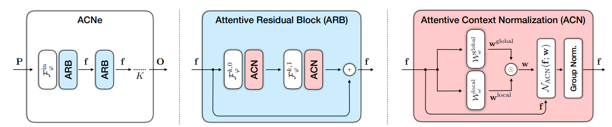

## ACNe:Attentive Context Normalization for Robust Permutation Equivariant Learning
### CVPR 2020
### Author Names, Group Name
[Paper implementation Link](https://github.com/vcg-uvic/acne)
* Note: Tensorflow

##### Why did I read this paper?
Current area of research, sequel to CNe

#### Paper keywords / Context
Context Normalization, Attentive Context Normalization, Outlier rejection, Permutation-equivariant learning, IRLS (Iterative Reweighted Least Squares), Mean and variance as result of least-squares

***

#### What problem does this paper try to solve?
Conventional CN normalizes feature maps according to mean and variance. These quantities can be expressed as solution of a least-squares problem. It is well known that least-squares optimization is not robust to outliers. Inspired by IRLS, design a network that learns to progressively focus its attention on the inliers. Two types of attention are considered: local(each data point individually) and global(relative importance of data points). i.e. weighted mean and variance. **The first to apply attentive mechanisms to the normalization of feature maps**.
***

#### Main contributions of the paper
Attentive mechanisms to feauture normalization
* Resulting in ACNe
* Local and Global weight multiplied to each other (merging)
* "One could use a parametric form of attention blending instead. However, it is non-trivial to combine the weights in a permutation-equivariant way"

***

### Key figures of the paper

**Robust neural line fitting**| Red: GT, Green: Network estimates. The proposed method learns to progressively focus its attention on the inliers. ALlows ACNe to find the correct soln where CNe fails.

**Generating Attention**| Local attention mechanism acts on each feature vector independently, whereas the global attention mechanism relates the feature vector for each data point to the collection through softmax.

**ACNe architecture**| Architecture of ACNe. Comprised of ARB, which is comprised of ACN.
***

#### Paper Highlights
The core idea behind attention mechanisms is to focus on the crucial parts of the input. 

The purpose of the attention Network is to compute a weight function that focuses the normalization of the feature maps on a subset of the input features - the inliers. 

We replace the Batchnorm used in CNE with Group Normalization (ECCV 18), as we found it performs better. BN works better for CNE.

We demonstrate that ACNe can be used to solve multiple applications, ranging from classical problems such as robust line fitting and point cloud classification on MNIST and MODELNet40, to robust camera pose estimation for wide-baseline stereo.

***

#### New approach/technique/method used in this paper 
ACNe
* discussed in depth already
***

#### Experiment - Takeaway
Experiment 1 : Robust line fitting, Classifying 3D objects, Wide-baseline stereo
* Reaches SoTA
* Focus on widebaseline stereo:
  * Outperforms baselines (CNe and OANet)
  * RANSAC variants harm ACNe. GLobal attention already infers relative importance of each correspondence. "In this manner, ACNe goes beyond simple outlier rejection."
  * Considering Lowe's ratio test and bidirectional check, traditional methods outperform reported scores of these traditional methods on baselines (CNe and OANet).

Experiment 2: Ablation
* Combination of Local and Global attention is the best
* Better if supervised attention
* BN better for CNe, GN(Group normalization) better for ACNe

***

#### Inputs and Outputs 
Inputs:
* Can be arbitrary, can be used to solve multiple applications.
* In terms of stereo matching, would be correspondences from image pairs

Outputs:
* Weights, which can be used for optimization algorithms.

***

#### Loss function (Objective function)
Differs by application of choice
* same protocol as CNe for wide baseline stereo

NOTE: The attention can be guided with supervision (such as valid correspondences...), which marginally improves the results.

***

#### Evaluation Metrics Used
Same metrics used as CNe for wide baseline stereo

***

#### Datasets Used
Same datasets as CNe for wide baseline stereo
* YFCC100M
* SUN3D

***

#### Conclusion and Future work
Still requires intrinsics!
* Try reading "Deep fundamental matrix estimation"

***

#### References worth following/noticing
-

***

#### Assume I am a reviewer: Strengths and weaknesses, what could have been better?
Notes on correctness
- seems correct enough

Notes on Clarity
- clear enough to understand.

Question I may want to ask the author
- It is impressive that it can be applied to all normalization-based outlier rejection mechanisms.

Figures - well labeled? with error bars?
- well labeled, but no error bars.

implicit assumptions, missing citations, and potential issues with experimental or analytical techniques?
-

How could I improve this paper?
- 