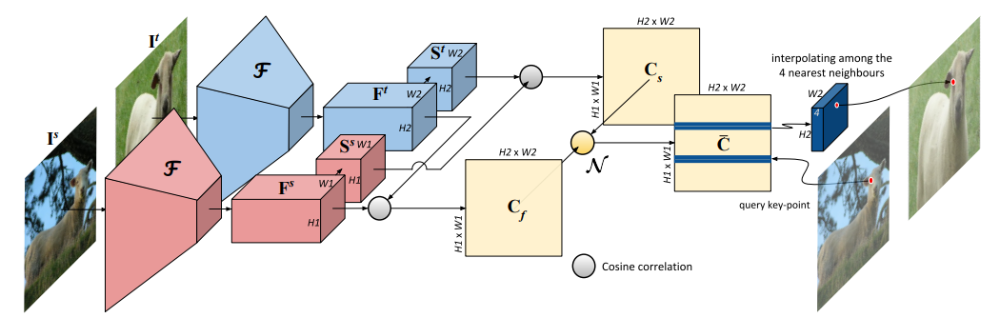
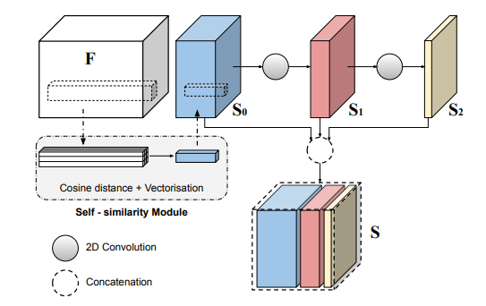
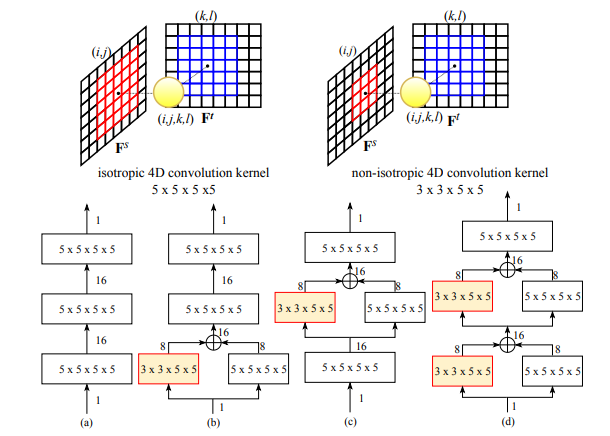
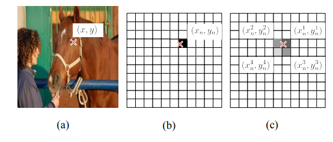
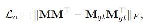

## Correspondence Networks with Adaptive Neighbourhood Consensus
### CVPR 2020
### Shuda Li, Kai Han, Victor Prisacario (Active Vision Lab, Visual Geometry Lab | University of Oxford)
[Paper implementation Link](https://github.com/ActiveVisionLab/ANCNet)
* [Their website](https://code.active.vision/) seems to have many interesting research

##### Why did I read this paper?
Current area of research, improvement to NCNet

#### Paper keywords / Context
Neighbourhood consensus, Adaptive neighbourhood consensus, Self-similarity module

***

#### What problem does this paper try to solve?
To learn neighborhood consensus for robust matching. For robust features (against intra-class variations,) simple and efficient multi-scale self-similarity module is introduced. To enfore one-to-one matching constraint, a novel orthogonal loss (<-this is the name) is introduced.
***

#### Main contributions of the paper
non-isotropic 4D convolutional kernel
* Means the dimension sizes are not all the same (ie not 3x3x3x3)
* For robust matching
* objects in real image often have varying scales and shapes
  * Two neighbourhoods depicting the same semantic meaning are very likely to have different sizes.
  * 3x3x5x5 is used. Its reverse kernel is not necessary, because the images are input twice in different orders for order invariance.

Simple and efficient multi-scale self-similarity to make the feature matching robust to intra-class variation
* Cosine distances of 3x3 neighbourhood features are calculated and then vectorized as features.
* Two levels of 2D convolutions followed by ReLU to increase the receptive field size
* Input and the two outputs are concatenated to form final feature map S.
* Has the effect of multi-scale inference? (differing receptive field size)

Novel orthogonal loss
* Enfore one-to-one constraints
* Supports one-to-zero constraints as well (might be visible only in one image.)

***

### Key figures of the paper

**ANC-Net architecture**| features F, self-similarity features S. 4D convolution separately on two Cs, sum them up to get final correlation tensor. Note that 4 correlation tensors are summed up, since flipped order is also performed to faciliate order invariance.

**Self-similarity module**| Explained in context. Figure is rather self-explanatory.

**Adaptive neighbourhood consensus**| a to d are design choices. b to d show the candidates for non-isotropic ANC candidates. Numbers 1 and 16 denotes the input and output channels. The non-isotropic kernels are zero padded so that the size of 4D correlation remains the same after each convolution.

**Generating the ground-truth probability map for each key point.**| Rescale each GT keypoint to the feature map size. This becomes sub-pixel accurate (means having decimal points), so NN is chosen. However, since feature maps are smaller than original images, a wrong choice will lead to devastating errors in pixel position. Therefore, 4 nearest neighbours are chosen (as seen in figure), where 2D gaussian smoothing is applied to enhance the performance. Each keypoint location annotation is converted into a 2D probability map, M.

**Orthogonal loss**| A plausible one-to-one matching constraint should be able to ignore the one-to-none matches in the data automatically. Inspired by nonnegative orthogonal GM algorithm, MM^T and identity matrix I should be near each other (each row of M contains only one element). Since one-to-none matches exist as well, we use the GT M(which have zeros on diagnals if one-to-none matches exist) instead of I as seen in the equation.

***

#### Paper Highlights
Uses the soft mutal NN filter in NCNet. Then uses argmax to extract the most likely matches (correspondences).

Uses sparse keypoint annotations as supervision, instead of matching pairs (weak supervision) in NCNet.

There are 302 images in the training split overlapping with either target or source images in the testing split of PF pascal. In terms of image pairs, there are 95 target-to-source pairs in the training split overlapping with the source-to-target pairs in the testing split. These are excluded for an **unbiased evaluation**

Other points have been sufficiently outlined (most of them by the figures and captions)

***

#### New approach/technique/method used in this paper 
* Adaptive Neighbourhood Consensus
* Self similarity module
* Orthogonal loss

***

#### Experiment - Takeaway
Experiment 1 : PCK of PF-Pascal, CUB, and Spair-71k
* Achieves SoTA
* Also SoTA on unabised evaluation of PF-Pascal

Experiment 2: Ablation of each method in paper
* Orthogonal loss is marginal
* The design choice d gives the maximum gain. The ablation table is quite hard to understand.

***

#### Inputs and Outputs 
Inputs:
* Image pair

Outputs:
* Correlation tensor of correspondence probabilities
* Argmax used to extract likely matches

***

#### Loss function (Objective function)
Frobenius Norm between the predicted M and Ground-truth M
* M is the probability map.
* + the orthogonal loss

***

#### Evaluation Metrics Used
PCK

***

#### Datasets Used
PF-Pascal, CUB, Spair-71k
* Why not PF-Willow?

***

#### Conclusion and Future work
-
***

#### References worth following/noticing
-

***

#### Assume I am a reviewer: Strengths and weaknesses, what could have been better?
Notes on correctness
- seems to be correct, but there seem to be many implicit assumptions and overclaims as well.
- Not all points are sufficiently proven empirically.

Notes on Clarity
- Clear enough to follow.

Question I may want to ask the author
* Why not experimented on PF-Willow?
* Why 3x3x5x5 only used for ANC?
* is ANC not redundant with self-smilarity multi-scale?
* Why only two convolutions in the proposed self-similarity module?

Figures - well labeled? with error bars?
- Well labeled, but no error bars

implicit assumptions, missing citations, and potential issues with experimental or analytical techniques?
-

How could I improve this paper?
-